### Parts

### Requisites
Map editing tools, such as:
 - [GPG Editor](https://wiki.faforever.com/index.php?title=Map_Editing_Tools)

Generation tools, such as:
 - [World Machine](https://www.world-machine.com/)

Image editing tools, such as:
 - [Gimp](https://www.gimp.org/)
 - [Photoshop](https://www.adobe.com/products/photoshop.html)
 - [Photoshop DDS plugin](https://developer.nvidia.com/nvidia-texture-tools-exporter)

Decal templates for this article:
 - [Decal templates](https://gitlab.com/supreme-commander-forged-alliance/other/decal-templates)

Instead of using a generation tool you can also use a sculpting tool - as long as its able to generate a high-resolution normal map.

If you use World Machine then you require at least the Indie version of World Machine. With the free edition you cannot generate textures that have sufficient size for any reasonably result.

### A warning
Adding in full-fledged normal maps will significantly increase the total size of your map (on your HDD). A 10x10 map that would be 2-4mb can quickly turn into a blob of over 25 mb. Please be careful when updating the map in the vault as it occupies a lot of storage space.

### Map-wide normal maps
A long part of the process of making maps is placing decals. A large portion of these are decals that affect the normals of the surface to simulate a more rough terrain while that is not actually the case. For more information about this, see also:
 - [About decals: Introduction](https://forum.faforever.com/topic/24/about-decals-introduction-part-1)

Essentially we will do the same but instead of manually placing hundreds of decals on the map we'll generate one large decal that encapsulates the majority of the detail. 

As an example we'll work with the map Long John Silver:

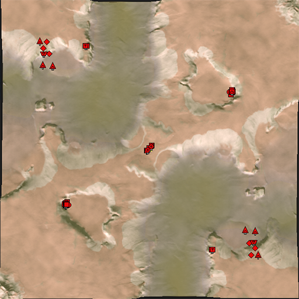

Which has the following heightmap:


With World Machine we'll generate the following normal map:

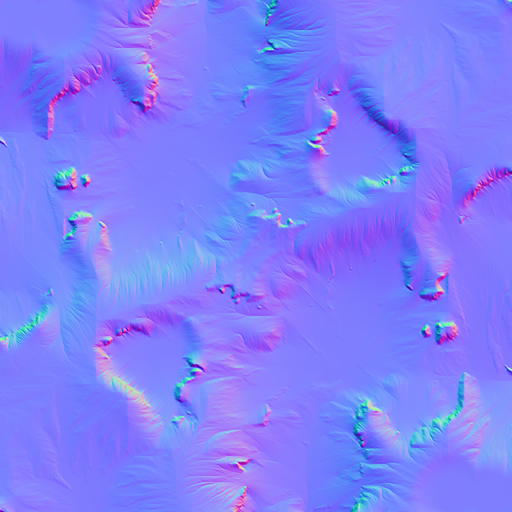

With our favorite image editing software we'll turn it into the decal format supported by Supreme Commander:

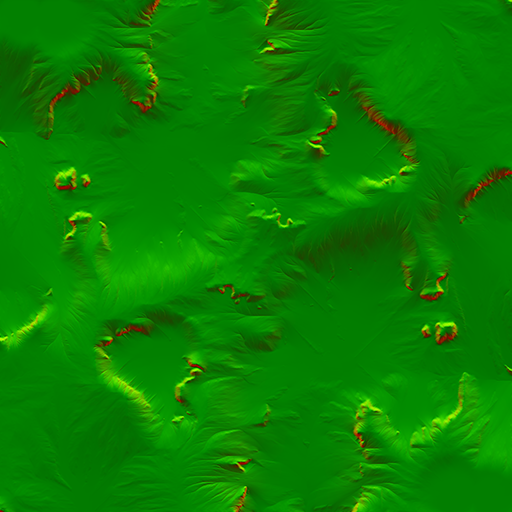

And with our template we'll place the decal exactly centered in the map ensuring that everything is properly aligned. This will result in images such as:

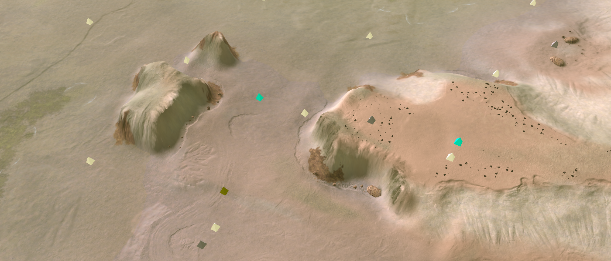
_On Long John Silver - with the map-wide normal map_

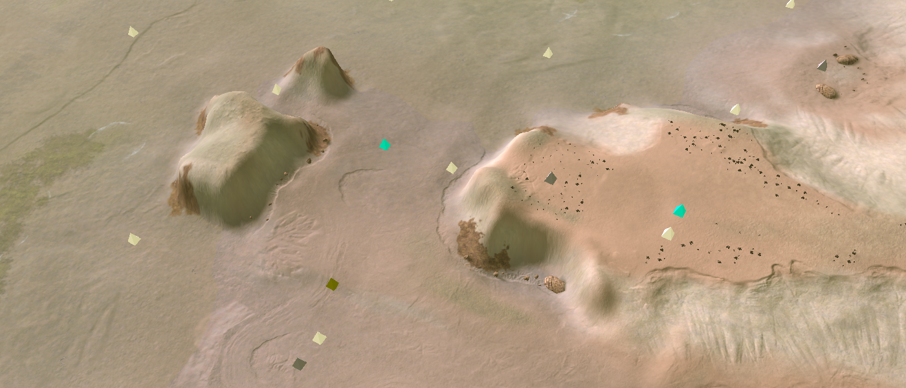
_On Long john Silver - without the map-wide normal map_

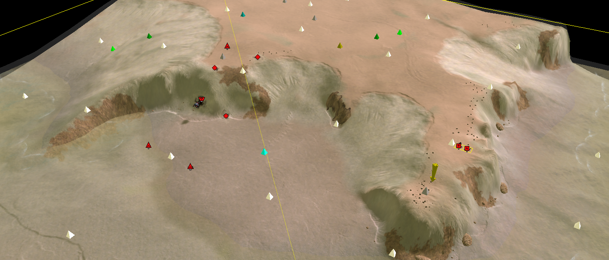
_On Long John Silver - with the map-wide normal map_

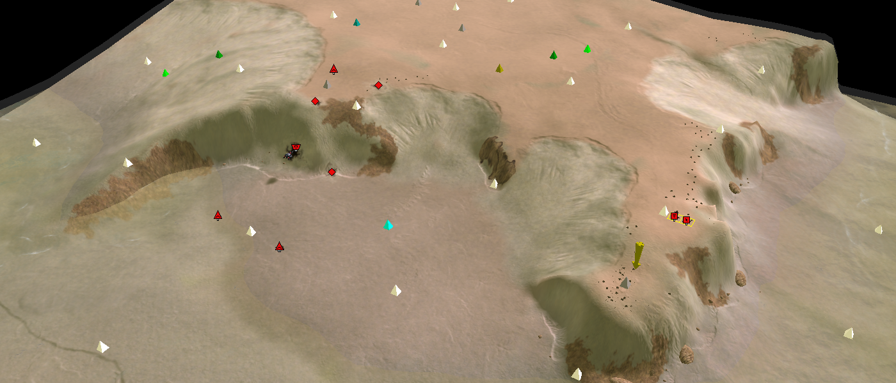
_On Long john Silver - without the map-wide normal map_

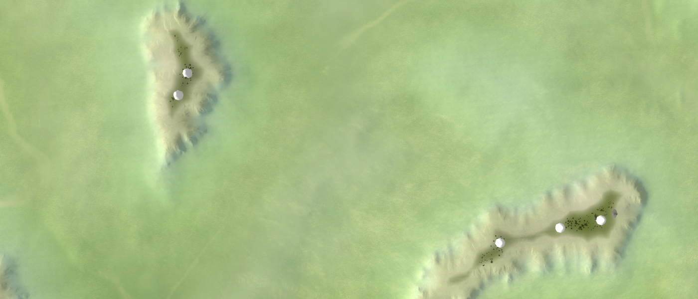
_On Mellow Shallows - with the map-wide normal map_

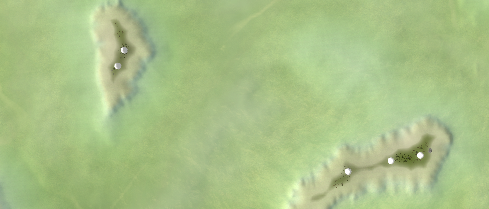
_On Mellow Shallows - without the map-wide normal map_

### Workflow in World Machine
We don't need World Machine to do a lot of complicated tasks. There are a few important tasks:
 - Change the resolution of the output
 - Import the previous heightmap with correct interpolation
 - Add erosion and tweak it
 - Turn it into a Normal map
 - Turn that normal map into a bitmap

You can find a ready-to-use world machine file in the decal template repository that you can find at the top. 

We'll start off with changing the resolution. Generally you want a resolution of `4096x4096`. Navigate to `World Commands -> Project World Parameters` and change the resolution accordingly. If you just want to preview your erosion results make sure to set it to `1024x1024` or `2048x2048` such that it takes less long to render.

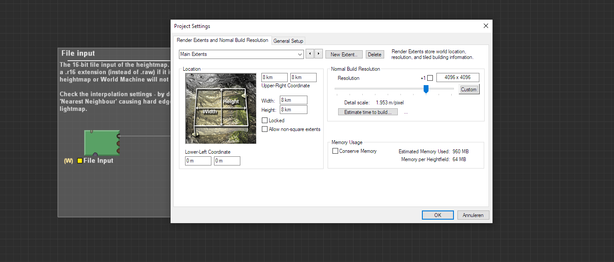
_Adjusting the resolution in the project settings in World Machine_

Next off we need to select our heightmap. You can export your heightmap from the Ozone editor or from the GPG editor. Make sure to rename the raw file from `.raw` to `.r16` as otherwise World Machine will not realise it is a raw file with 16 bits per pixel. Select your raw file and then select the correct interpolation mode. I personally like to use Fractal but any except `Nearest Neighbours` is fine. The `Nearest Neighbours` will make the heightmap quite blocky.

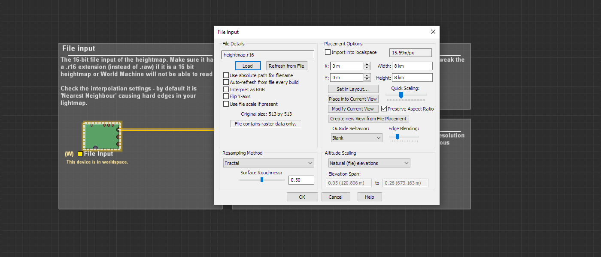
_Selecting the correct heightmap in `r.16` format and choosing an interpolation mode_

Then we create the rest of the node network. For this simple setup we'll be completely relying on the `Erosion` node. It has various presets to choose from and properties to tweak - feel free to look around and see its effects. If you degenerate too far from the actual terrain (it erodes away) then you'll generally have a poor result - as the normal map does not reflect the heightmap anymore.

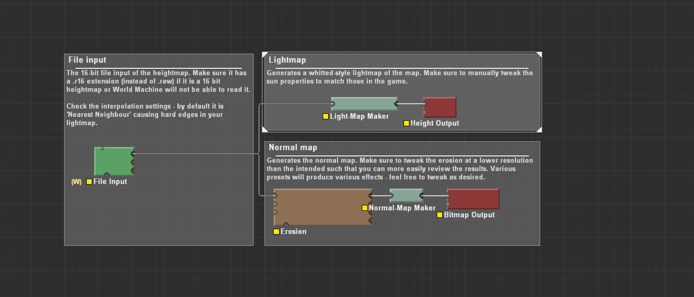

Last but not least is building the result. Make sure to save these as .png files as we do not need the full 16 bits for decals. The building process can take a while. Once that is done we're ready to jump into our image editing software.

### Image Editing Software
The actions in question depend on your software suite. You do not need Photoshop - Gimp is sufficient. Essentially we want to transform the normal map generated into a different format. We do this via:
 - Copying the red channel into the alpha channel.
 - Copying the blue channel into the red channel.
 - Making the blue channel black.
 - Inverting the red channel.

And that is it - you'll now see the typical decal-style normal map that you'd expect. You can toy around with the contrast in the red channel to create sharper edges. I'll leave this to you to experiment with.

Store the resulting image as a `.dds` with the `BC5` or `BC3 with interpolated alpha` compression. In general the `BC3` version will use less storage. For more information about this:
 - https://forum.faforever.com/topic/245/normal-map-conversion-using-photoshop

Make sure to save it in a directory such as `/maps/example-map.v0001/env/decals/normal.dds` where `example-map.v0001` is replaced with the name of your map. It is critical that it is stored in the `env/decals` hierarchy structure - otherwise the game and the Ozone editor will not recognize your textures as decals.

### Using the decal presets
Start up your map in the GPG editor. Make sure to copy it to the `/maps` directory of the original Supreme Commander installation directory - otherwise the GPG editor will not be able to load your map and probably crash.

Once loaded up it is time to copy the correct template to your map. I assume that your map is square as all the presets are square too. If you use area's to hide certain bits of the map then that doesn't matter too much. Choose your template depending on the map size. As for this tutorial we'll work with the `10x10.lua` template as `Long John Silver` is 10x10.

For the template I've removed the lighting map as it is not relevant for this guide. Make sure to replace `example-map.v0001` with your map name. In the case of the guide this is `adaptive_long_john_silver`. Then make sure that the path is correct - if you followed the guide precisely then you should be good.


``` lua 
Decals = {
    --
    ['9000'] = {
        type = 'Normals',
        name0 = '/maps/adaptive_long_john_silver/env/decals/normal.dds',
        name1 = '',
        scale = { 512, 512, 512 },
        position = { 0, 0, 0 },
        euler = { -0, 0, 0 },
        far_cutoff = 10000,
        near_cutoff = 0,
        remove_tick = 0,
    },
    --
}
```

Import your adjusted `10x10.lua` by going to `File -> Import -> Decals` in the GPG editor. You should see a decal that stretches across the entire map - if it is too big or too small than you've chosen the wrong template for your map. Save the map and then all should be good.


### Testing your map
Make sure to test your map by copying it back to the folder that is used by the vault. Generally this is `/%USERPROFILE%/My Games/Gas Powered Games/Supreme Commander Forged Alliance/maps` where `%USERPROFILE%` is replaced with the user profile that has the game installed.

### Frequently Asked Questions (FAQ)

#### My map looks all weird after importing - what is going on?
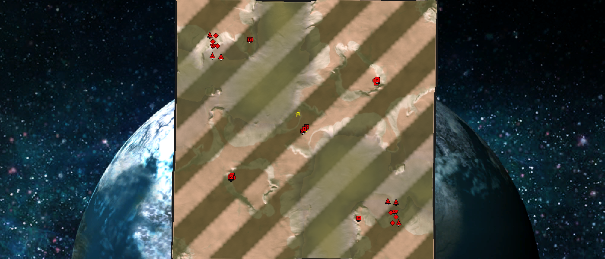
_The default texture that is loaded when it can't find a texture_ 

This is typically the default texture that is loaded. To be exact, it is this texture:
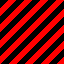

The engine uses this when it can't find a texture. There could be various reasons:
 - The path in your template file is off. Make sure that the local path actually references a file in your map folder structure. As an example, if your path is `/maps/adaptive_long_john_silver/env/decals/normal.dds` then there should be a folder called `env` inside your map folder, followed by a folder called `decals` with a texture named `normal.dds` in it. Make sure to watch for typos.
 - The GPG editor sometimes refuses to load in textures. I am not entirely confident as to why this is. From practice I know that you can save the map and open it up with the Ozone editor. If it shows correctly in the Ozone editor then it will show correctly in-game. Of course - it can't hurt to check that.


#### My map looks all weird for other people who downloaded it from the vault - what is going on?
The path to your texture files may not always be properly updated - in that case you need to manually update it. This is easiest done in the Ozone editor. We only use the GPG editor to load in a perfectly map-wide aligned decal - from that point on you are free to go back to the Ozone editor and change the texture as you desire.

#### When updating the texture in the Ozone editor nothing changes!
The Ozone editor caches textures to speed up the application. It is best to save the adjusted texture with a separate name - then reload the map folder by switching back and forth the map folder. You'll see the new texture and you can now safely replace it with the old one. At the end make sure you only have the texture you use in your map folder as these textures take up a lot of bandwidth. 

### Sources
About decals in general:
 - https://forum.faforever.com/topic/24/about-decals-introduction-part-1

A guide written by me on normal maps in Supreme Commander:
 - https://forum.faforever.com/topic/245/normal-map-conversion-using-photoshop

About normal maps in general
 - https://learnopengl.com/Advanced-Lighting/Normal-Mapping
 - https://docs.unity3d.com/Manual/StandardShaderMaterialParameterNormalMap.html
  
About the decal format:
 - http://www.adriancourreges.com/blog/2015/06/23/supreme-commander-graphics-study/

### About you
If you have interesting sources, approaches, opinions or ideas that aren't listed yet but may be valuable to the article: feel free to leave a message down below or contact me on Discord. The idea is to create a bunch of resources to share our knowledge surrounding various fields of development in Supreme Commander.

If you've used this resource for one of your maps feel free to make a post below: I'd love to know about it!

### Credits
With thanks to @svenni_badbwoi for having a chat with me about his approach :) .