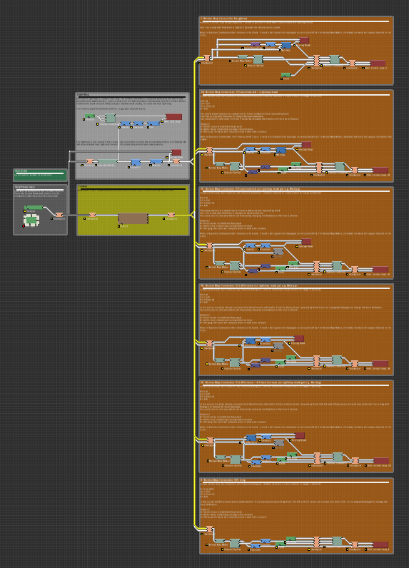
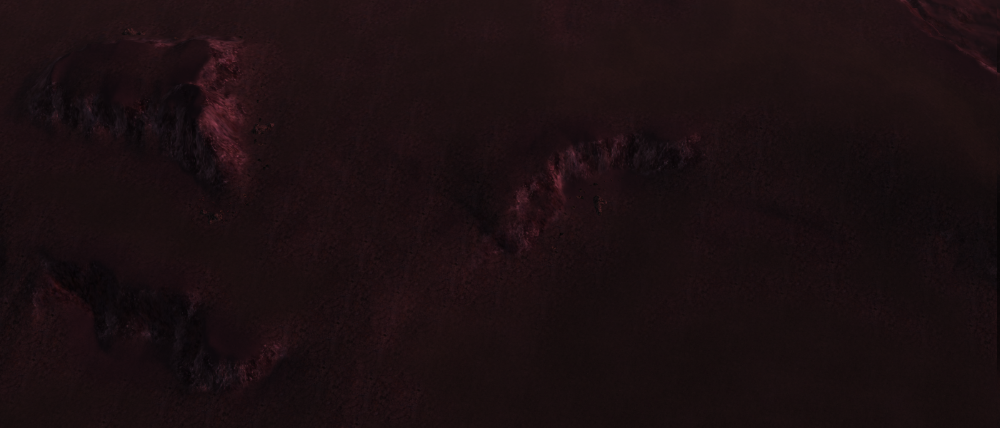
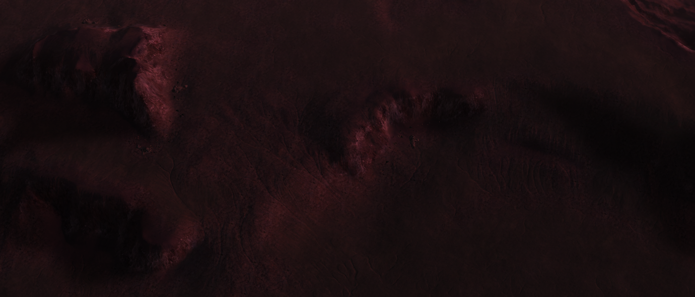
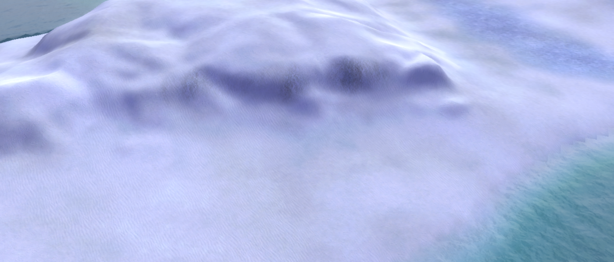
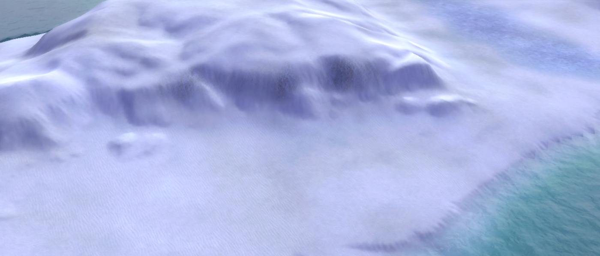
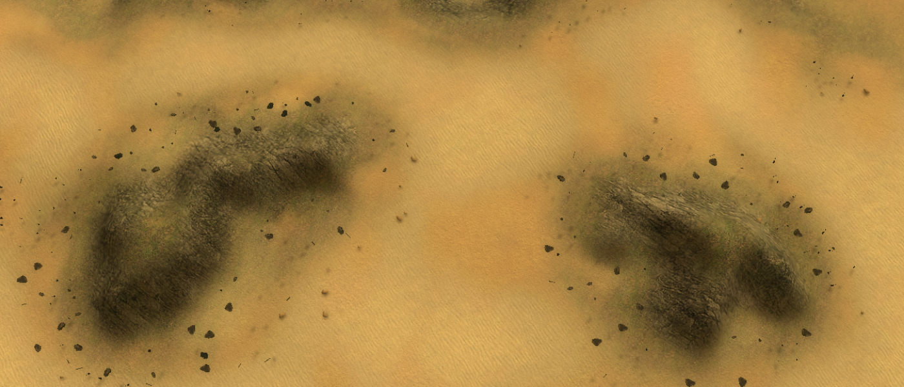

### Parts
 - [Introduction on decals](https://forum.faforever.com/topic/24/about-decals-introduction-part-1)
 - [Converting normal maps](https://forum.faforever.com/topic/245/about-decals-converting-normal-maps)
 - [World Machine Templates](https://forum.faforever.com/topic/1090/about-decals-world-machine-templates)
 - [Generating a map-wide normal texture](https://forum.faforever.com/topic/785/about-decals-generating-a-map-wide-normal-texture)
 - [Generating a map-wide lighting texture](https://forum.faforever.com/topic/786/about-decals-generating-a-map-wide-lighting-texture)

### Requisites
Generation tools, such as:
 - [World Machine](https://www.world-machine.com/)

World Machine templates for this article:
 - [Templates on Gitlab](https://gitlab.com/supreme-commander-forged-alliance/other/decal-templates)

### About the templates
The templates are designed to assist you in creating various map-wide content. They are as they are - merely a template. What the templates can do for you:
 - Generate a map-wide light map
 - Generate a map-wide normal map via various techniques for the alpha channel
 - Generate a map-wide ambient occlusion map (Mt. Rainier or higher)
 - Position the map-wide content with a pixel-precision in your map

The actual work is still up to you, including:
 - The creation of a heightmap
 - Adjustments to the heightmap that would make an interesting normal map

This template is not magic and it still requires you to understand what it can do for you. The template is practically worthless if you have the basic edition of World Machine - you could at most generate a light and ambient occlusion map for maps up to 10x10 reliably.

#### Template for Mt. Daniel 3026

World machine file: `workflow-3026.tmd`

Supports the following features:
 - Light map generation
 - Normal map via Roughness as alpha
 - Normal map via inverted Z-axis as alpha
 - Normal map via R-G difference as alpha

All normal maps are automatically converted to the green-looking normal map format that Supreme Commander expects for its decals.

 
_Overview of the 3026 version_

#### Template for Mt. Rainier 4016

World machine file: `workflow-4016.tmd`

Supports the following features:
 - Ambient occlusion map generation
 - Light map generation
 - Normal map via Roughness as alpha
 - Normal map via inverted Z-axis as alpha

All normal maps are automatically converted to the green-looking normal map format that Supreme Commander expects for its decals.

 
_Overview of the 4016 version_

### Tips and Tricks

#### Raw files
World Machine has an interesting interpretation of raw files. Instead of dynamically determining of a raw file is 8 or 16 bits it looks at its extension. A `.raw` file is considered to be 8 bits where as a `.r16` raw file is considered to be 16 bits.

When you export the heightmap from any editing tool you'll have a `.raw` file. However, its contents are encoded in 16 bits. Therefore make sure to rename it to `.r16` - otherwise World Machine will not be able to understand the raw file in question.

#### Resolutions
For a light map you can use a resolution that is the same resolution of the heightmap. That will produce sufficient results. You can view a comparison for a 20x20 (1024 heightmap resolution) map at:
 - https://forum.faforever.com/topic/786/about-decals-generating-a-map-wide-lighting-texture/2

For a normal map you need to use a resolution that is at least eight times the resolution of the heightmap. Anything lower will produce blurred and insignificant results.

#### Eroding
It may appear interesting to erode your heightmap too much. This can and will cause issues in the long run where the normal map is no longer in sync with the heightmap in question. Therefore use erosion at your own risk.

#### Memory
World Machine tends to be memory hungry when generating its content. It can help a lot to do your final build in tiles. This significantly reduces the memory consumption of World Machine without affecting the end result. You can read more about it in Chapter 10 of the World Machine User Guide starting at page 70:
 - https://www.world-machine.com/WM2%20User%20Guide.pdf

This is a professional feature and is therefore not available to everyone.

#### Normal maps
Whenever you use normal maps make sure that their axis are correctly represented. In the case of map-wide normal maps we need to flip the y-coordinate. This is done in the normal conversion node itself.

### Examples

 
_A selection of the **5th Nomad Mission** without (top) and with (bottom) these techniques applied_

 

 
_A selection of **Adaptive Skadi** without (top) and with (bottom) the normal map technique applied_

 

 
_A selection of **Salt and Pepper** without (top) and with (bottom) the normal map technique applied_

 

### About you
If you have interesting sources, approaches, opinions or ideas that aren't listed yet but may be valuable to the article: feel free to leave a message down below or contact me on Discord. The idea is to create a bunch of resources to share our knowledge surrounding various fields of development in Supreme Commander.

If you've used this resource for one of your maps feel free to make a post below: I'd love to know about it!

### Credits
 - With thanks to Beherith from the BAR community for the opportunity to have an Q&A for two hours about World Machine
 - With thanks to @svenni_badbwoi  for creating the template for World Machine Mt. Daniel 3026.
 - With thanks to @Balthazar for various discussions on normal maps and their interpretation in Supreme Commander.