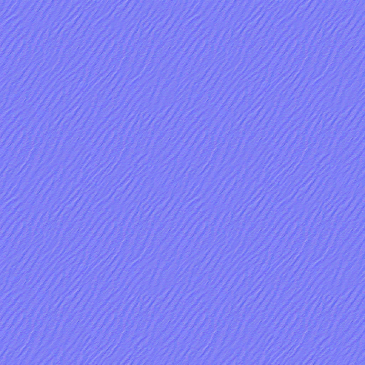
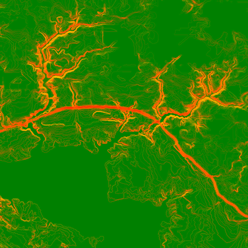
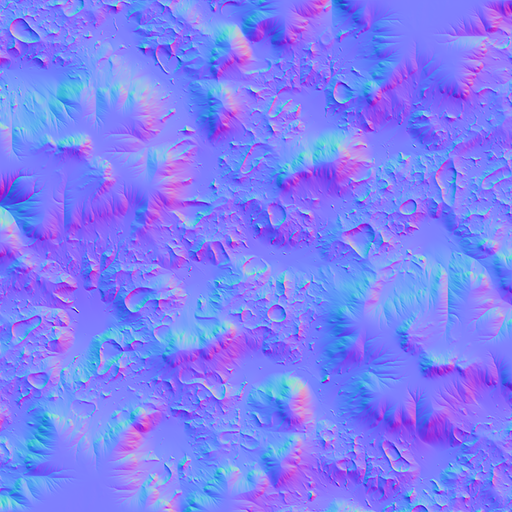
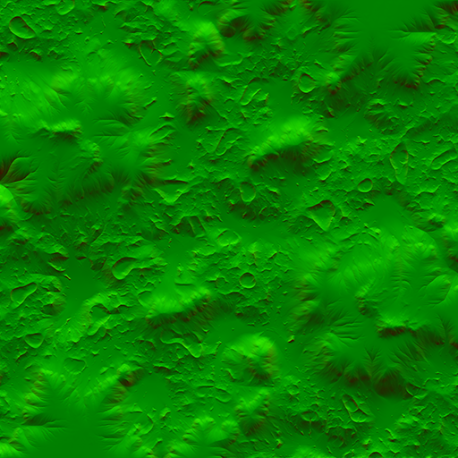
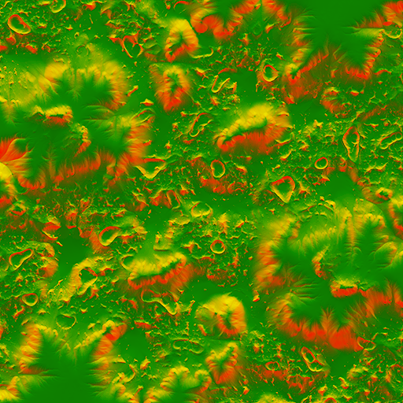

### Parts


### Requisites
Image editing tools, such as:
 - [Adobe Photoshop CS](https://www.adobe.com/products/photoshop.html)
 - [NVIDIA exporter](https://developer.nvidia.com/nvidia-texture-tools-exporter)
or
 - [Gimp](https://www.gimp.org/)

### About normal maps
A `normal map` is a graphical term used to describe surface texture. They are used throughout games to create a sense of detail on entities. The geometry of an entity is generally limited - geometry is expensive to process. A clear example of this is the (at times: extensive) usage of decals that function as normal maps on various maps.

 

_One of the examples in the [introduction article on decals](https://forum.faforever.com/topic/24/about-decals-introduction-part-1) that shows a terrain with and without decals that function as normal maps_

A more general introduction of normal maps is that of a flat plane that represents a brick wall. The joints between the bricks are too detailed to represent in the geometry and therefore we fake this feeling of detail with normal maps.

 

_An example from [LearnOpenGL](https://learnopengl.com/Advanced-Lighting/Normal-Mapping) that clearly shows the increase in detail_

Today, in the (more) modern age, geometry is no longer a limiting factor given that [tessalation](https://en.wikipedia.org/wiki/Tessellation_(computer_graphics))  exists. On top of that, normal maps are replaced with [PBR](https://marmoset.co/posts/basic-theory-of-physically-based-rendering/) maps - which is topic that needs an article or 10 on its own.

In Supreme Commander there are two types of normal maps used throughout the game:

 

_The typical `purple normal map` commonly used on units and as a strata normal map_

 

_A more uncommon `green normal map` used for decals to add in detail into the terrain_

### About the green normal map

The green normal map is a different format that is more friendly to compression. 

We have four channels: R, G, B and A. The **R**ed channel represents the alpha channel in the new format. The **G**reen and **A**lpha channels represent the normal map and the **B**lue channel can be discarded due to a math trick: it can be re-computed in the shader dynamically - shaving off valuable storage that the texture will take on disk.

### Transformation

For this article I assume that you have a `purple normal map` that you want to turn into a `green normal map`. For the sake of this guide we'll use the following normal map:



_The `purple normal map` that we'll use throughout this article. It represents a map-wide normal map for the map Mellow Shallows_

#### Procedure in Photoshop

 - Open the `purple normal map`
 - Go to `Channels` (not Layers) view
 - Click on `New channel` to add an alpha channel
 - `Copy` the content of the red channel into the alpha channel
 - `Copy` the content of the blue channel into the red channel
 - `Invert (CTRL + I)`  the red channel
 - Make the blue channel completely black via a black brush

#### Procedure in Gimp

 - Open the `purple normal map`
 - Open `Layers` (not Channels) view
 - Decompose the Image via `Color > Components > Decompose > RGB`
 - Select the `Blue` layer
 - - Invert it via `Color > Linear Invert`
 - - Use Levels to remove the decal on low slopes via `Color > Levels > 0-25/50` (The decal content will overlay all other normal information in the map, where the alpha is white. It will be transparent/invisible where the alpha is completely black)
 - Compose new Image with Alpha via `Color > Components > Compose > RGBA`
 - - R = B (Linear Invert + Levels)
 - - G = G
 - - B = B (will be removed later)
 - - A = R
 - Turn Blue channel completely black (e.g. `Color > Curves > Channel Blue > Turn it to zero`

#### Common last steps

The result of this procedure should be similar to:

 
_An example output of the full procedure_

As mentioned before - the red channel is the alpha channel. Hence - if you're seeing no red on your texture then the normal map will be hardly visible. You can tune the red channel to make it more visible, as an example we increase the contrast of the red channel significantly:

 
_An example of tuning the red channel_

Store the file in the `.dds` format. In Photoshop make sure to save it as `BC3 with interpolated alpha` or in Gimp as `DXT5`. They are the same format but with a different name.

### Technical discussion

#### Tell me about the rendering procedure

Happy to. The following code is the shader code that processes the `green normal map` for rendering.

```c
// as part of effects/terrain.fx
float4 DecalsNormalsPS( VS_OUTPUT inV, uniform bool alphablend ) : COLOR
{
	// read textures
	float4 decalMask = tex2Dproj( DecalMaskSampler, inV.mTexDecal );
	float4 decalRaw = tex2Dproj( DecalNormalSampler, inV.mTexDecal );
	float3 decalNormal;

        // compute x/z and recompute the y axis
	decalNormal.xz = decalRaw.ag * 2 - 1;
	decalNormal.y = sqrt(1 - dot(decalNormal.xz,decalNormal.xz));

	// rotate the decalnormal by the decal matrix to get the decal into world space
	// from tangent space
	decalNormal = mul( TangentMatrix, decalNormal);
	decalNormal = normalize(decalNormal);

	// our blend mask is stored in the r channel of the decal
	float blendFactor = decalRaw.r;

	// get decal normal back into 0..1 range and output
	decalNormal = (decalNormal * 0.5) + 0.5;
	return float4( decalNormal.xzy,  blendFactor * decalMask.w * DecalAlpha);
}
```

There are two relevant texture look-ups:
 - `decalMask` represents a small cut-off at the edge of any decal
 - `decalRaw` represents our `green normal map`.

We base-line the `x` / `z` values from the raw texture . Any normal is normalized which means that the length of the vector (a normal represents a vector) is normalized too. We can use this principle to compute the `y` element - since the length (`sqrt(x*x + y*y + z*z)`) must equal to 1. 

This is why we can remove the blue channel as we only need the alpha and the green channel to represent the full texture. In turn, the blue channel can be more easily compressed by compression software, such as Peazip. And that is exactly what happens as the `.scd` files in the data folder of the game are essentially `.zip` files with a different extension.

Last but not least we use the red channel of the raw texture as part of the computation of the alpha channel. The alpha channel represents transparency - that is how we can stack multiple normal decals on top of one another. They are all rendered on top of one another but due to this transparency a normal decal that is underneath can still be visible.

We can summarize that for the `green normal map` its channels are used as:
 - **R**ed: As transparency
 - **G**reen: as the x coordinate of the normal
 - **B**lue: unused
 - **A**lpha: as the z coordinate of the normal

#### Why does the blue channel become the red (alpha) channel?

The blue channel represents the Y-direction of the normal. In Supreme Commander the Y-axis is the up-axis - when you move a unit in the Y-direction it moves up into the air.

By using the Y-axis as our alpha channel we are essentially saying: we want the bits that point upwards to be visible. When we invert it we are saying: we want all the bits but those that point upwards to be visible. Via tuning we can make those bits more or less visible - as we did in this guide.

#### What is the pros / cons of having a completely white red (alpha) channel?

An advantage is that the size of your texture will be smaller on disk after compression. A map (or mod) is for example compressed on the server - when a channel is completely uniform then it will result in a lower total file size and therefore less bandwidth for the server.

A disadvantage is that any other (normal) decal that is below your normal will be non-existent. When you are making a map-wide decal than this may be intended - but for a typical decal this is not recommended.

### Sources

For more information on why the terrain uses a different type of normal map:
 - http://www.adriancourreges.com/blog/2015/06/23/supreme-commander-graphics-study/

For more information on normal maps in general:
 - https://learnopengl.com/Advanced-Lighting/Normal-Mapping
 - https://docs.unity3d.com/Manual/StandardShaderMaterialParameterNormalMap.html

For more information about the DDS format:
 - http://developer.download.nvidia.com/whitepapers/2008/real-time-normal-map-dxt-compression.pdf

A well written guide of how normal maps are used in another: Smash 4!
 - https://gamebanana.com/tuts/12222

### About you

If you have interesting sources, approaches, opinions or ideas that aren't listed yet but may be valuable to the article: feel free to leave a message down below or contact me on Discord. The idea is to create a bunch of resources to share our knowledge surrounding development in Supreme Commander.

If you've used this resource for one of your maps feel free to make a post below: I'd love to know about it!

### Credits
With thanks to @svenni_badbwoi for the Gimp procedure and to @Balthazar for various help along the way.